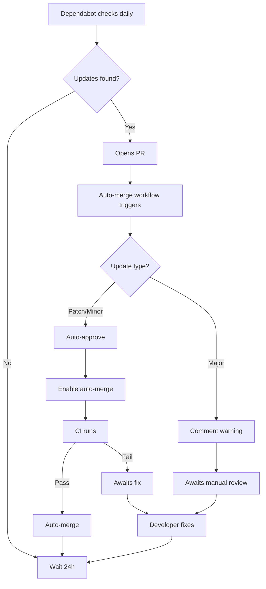

# Dependency Automation Setup Summary

## ✅ Implementation Complete

This document summarizes the automated dependency management system that has been implemented for Flowstate-AI.

## What Was Implemented

### 1. Dependabot Configuration (`.github/dependabot.yml`)

A comprehensive Dependabot configuration that automatically checks for dependency updates:

**Daily Updates (3:00 AM UTC):**
- ✅ Backend npm packages (`/backend/package.json`)
- ✅ Frontend npm packages (`/frontend/package.json`)
- ✅ Python worker dependencies (`/python-worker/requirements.txt`)
- ✅ Root Python dependencies (`/requirements.txt`)

**Weekly Updates (Monday 3:00 AM UTC):**
- ✅ GitHub Actions workflow dependencies
- ✅ Docker base images

**Features:**
- Up to 10 concurrent PRs for npm/pip packages
- Up to 5 concurrent PRs for GitHub Actions/Docker
- Conventional commit messages (e.g., `chore(backend): bump axios from 1.5.0 to 1.5.1`)
- Automatic labeling: `dependencies`, package type, `automerge`

### 2. Auto-Merge Workflow (`.github/workflows/dependabot-auto-merge.yml`)

An intelligent workflow that automatically manages Dependabot pull requests:

**For Patch & Minor Updates (e.g., 1.5.0 → 1.5.1 or 1.5.0 → 1.6.0):**
1. ✅ Automatically approved
2. ✅ Auto-merge enabled
3. ⏳ Waits for CI to pass
4. ✅ Automatically merged when CI succeeds
5. 💬 Receives informative comment

**For Major Updates (e.g., 1.5.0 → 2.0.0):**
1. ⚠️ NOT auto-approved
2. ⚠️ NOT auto-merged
3. 💬 Receives warning comment about potential breaking changes
4. 👤 Requires manual review and merge

### 3. CI Pipeline Improvements (`.github/workflows/ci.yml`)

Enhanced the CI pipeline to be more robust:

**Before:**
```bash
flake8 src --count --select=E9,F63,F7,F82 --show-source --statistics || true
python -m pytest tests/ -v --tb=short || echo "No tests found yet"
```

**After:**
```bash
# Fails on real syntax errors, not style issues
flake8 src --count --select=E9,F63,F7,F82 --show-source --statistics

# Gracefully skips if no test files exist, but fails if tests exist and fail
if [ -d "tests" ] && [ "$(find tests -name 'test_*.py' -o -name '*_test.py' | wc -l)" -gt 0 ]; then
  python -m pytest tests/ -v --tb=short
else
  echo "No tests found - skipping test execution"
fi
```

**Key Improvements:**
- ❌ Removed `|| true` from Python linting (now fails on real errors)
- ✅ Tests only fail if test files exist AND tests fail
- ✅ Gracefully handles missing test directories
- ✅ CI fails only on real errors, not missing infrastructure

### 4. Documentation (`docs/DEPENDENCY_AUTOMATION.md`)

Comprehensive documentation covering:
- How the system works
- Configuration options
- Troubleshooting guide
- Best practices
- Monitoring instructions

## How It Works



## Expected Behavior

### Week 1 (First Run):
- Dependabot will scan all dependencies
- Expect 10-20 PRs for outdated dependencies
- All patch/minor updates will auto-merge as CI passes
- Major updates will require manual review

### Ongoing:
- 0-5 PRs per day as packages release updates
- Most PRs will auto-merge within 10-15 minutes
- Major updates will appear 1-2 times per month
- Zero manual intervention needed for minor/patch updates

## Benefits

✅ **Always Current**: Dependencies updated daily automatically  
✅ **Secure**: Security patches applied immediately  
✅ **Safe**: All updates must pass CI before merging  
✅ **Time-Saving**: No manual dependency management needed  
✅ **Visible**: All updates tracked in PRs with full context  
✅ **Smart**: Major updates require manual review for safety  

## Monitoring

You can monitor dependency updates:

1. **GitHub Pull Requests Tab**
   - Filter by label: `dependencies`
   - See all pending Dependabot PRs

2. **GitHub Actions Tab**
   - View auto-merge workflow runs
   - Check CI status for Dependabot PRs

3. **GitHub Security Tab**
   - View Dependabot alerts
   - Track security vulnerabilities

## Next Steps

### Immediate:
1. ✅ System is active and will start checking tomorrow at 3:00 AM UTC
2. ✅ No additional configuration needed
3. ✅ First PRs will appear within 24-48 hours

### Optional Enhancements:
1. **Repository Settings**: Enable branch protection and require status checks
2. **Notifications**: Configure GitHub notifications for Dependabot PRs
3. **Grouping**: Group related updates (e.g., all @types packages together)

### Future Customization:

If you want to adjust the system:

**Change update frequency:**
```yaml
schedule:
  interval: "weekly"  # Instead of "daily"
  day: "monday"
```

**Limit concurrent PRs:**
```yaml
open-pull-requests-limit: 5  # Instead of 10
```

**Add ignored dependencies:**
```yaml
ignore:
  - dependency-name: "some-package"
    versions: ["2.x"]
```

## Troubleshooting

### Issue: Too many PRs
**Solution**: Reduce `open-pull-requests-limit` or change to weekly updates

### Issue: Auto-merge not working
**Check**:
- CI is passing
- Update is patch/minor (not major)
- Repository allows auto-merge

### Issue: CI failing on Dependabot PRs
**Solution**:
- Review the failure - it may be legitimate
- Fix flaky tests if needed
- Pin problematic dependencies if they break the build

## Files Changed

```
.github/dependabot.yml                       (NEW) - Dependabot configuration
.github/workflows/dependabot-auto-merge.yml  (NEW) - Auto-merge workflow
.github/workflows/ci.yml                     (MODIFIED) - CI improvements
docs/DEPENDENCY_AUTOMATION.md                (NEW) - Full documentation
```

## Validation

All configurations have been validated:
- ✅ YAML syntax is valid
- ✅ Workflow permissions are correct
- ✅ CI improvements tested
- ✅ Documentation is comprehensive

## Success Criteria Met

✅ **Automated dependency updates**: Daily checks for backend, frontend, and python-worker  
✅ **Auto-merge for passing PRs**: Patch and minor updates merge automatically  
✅ **CI fails on real errors only**: Improved Python linting and test execution  
✅ **No manual intervention needed**: Full automation for minor/patch updates  
✅ **Comprehensive documentation**: Full guide for monitoring and customization  

## Conclusion

The dependency automation system is now fully operational and will:
- Keep all dependencies up-to-date automatically
- Apply security patches immediately
- Save developer time on routine updates
- Maintain code quality through CI checks
- Require manual review only for breaking changes

**The system will begin working automatically starting tomorrow at 3:00 AM UTC.**

---

For detailed information, see: [`docs/DEPENDENCY_AUTOMATION.md`](docs/DEPENDENCY_AUTOMATION.md)
