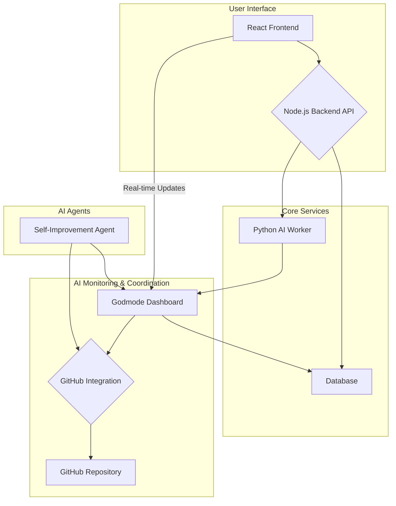

# Flowstate-AI System Architecture

This document provides a comprehensive overview of the system architecture for Flowstate-AI, an AI-first, self-improving CRM-OS. It details the various components, their interactions, and the overall data flow within the system.

## High-Level Overview

The Flowstate-AI system is a distributed application composed of several key services that work together to provide a comprehensive CRM and AI-driven workflow management platform. The architecture is designed to be modular, scalable, and resilient, with a clear separation of concerns between the different components.

The primary components are:

*   **Frontend**: A React-based single-page application (SPA) that provides the user interface.
*   **Backend**: A Node.js/Express application that serves as the main API and business logic layer.
*   **AI Worker**: A Python/FastAPI service that handles AI-powered tasks such as generating "Next Best Actions" and processing reminders.
*   **Godmode Monitoring Dashboard**: A Python/Flask application with a real-time dashboard for monitoring the status and performance of all AI agents.
*   **Database**: A relational database (SQLite for development, PostgreSQL for production) for data persistence.
*   **GitHub Integration**: A set of utilities for coordinating AI agent tasks and managing the development lifecycle through GitHub.

## System Architecture Diagram

## Component Details

### 1. Frontend (React + TypeScript + Vite)

*   **Description**: The frontend is a modern, responsive web application built with React and TypeScript. It provides the user with a rich interface for managing customers, tracking interactions, and visualizing the sales pipeline.
*   **Key Features**: Customer management, pipeline visualization, interaction logging, and real-time updates from the Godmode Dashboard.
*   **Communication**: Interacts with the Backend API via RESTful endpoints for data retrieval and manipulation. It also establishes a WebSocket connection with the Godmode Dashboard for real-time status updates.

### 2. Backend (Node.js + Express + TypeScript)

*   **Description**: The backend is the central hub of the application, handling all business logic, data processing, and API requests.
*   **Key Features**: User authentication, customer data management, interaction tracking, and API endpoints for all frontend functionalities.
*   **Communication**: Exposes a RESTful API for the frontend. It communicates with the Database for data persistence and can trigger tasks in the AI Worker.

### 3. AI Worker (Python + FastAPI)

*   **Description**: The AI Worker is a separate service responsible for executing computationally intensive or long-running AI-related tasks.
*   **Key Features**: Processing reminders, generating "Next Best Action" recommendations, and other AI-driven analyses.
*   **Communication**: Exposes its own set of API endpoints. It is called by the Backend to perform specific tasks and can also run scheduled jobs independently.

### 4. Godmode Monitoring Dashboard (Python + Flask + SocketIO)

*   **Description**: This component provides a real-time dashboard for monitoring the health, status, and performance of all AI agents within the Flowstate-AI system.
*   **Key Features**: Real-time status updates, progress bars for ongoing tasks, system-wide statistics, and AI agent profiles.
*   **Communication**: It communicates with the database to fetch historical data and receives status updates from the AI agents. It uses WebSockets (via Flask-SocketIO) to push real-time updates to the frontend.

### 5. Database (SQLite/PostgreSQL)

*   **Description**: The database stores all persistent data for the application, including customer information, interactions, AI agent status, and performance metrics.
*   **Technology**: SQLite is used for local development for its simplicity, while PostgreSQL is recommended for production environments due to its robustness and scalability.

### 6. GitHub Integration

*   **Description**: This component provides a set of utilities for interacting with the GitHub API. It is used for coordinating AI agent tasks, creating issues for performance problems, and managing the development lifecycle.
*   **Key Features**: Creating and updating GitHub Issues, creating Pull Requests, and commenting on issues.
*   **Communication**: Interacts with the GitHub API using RESTful requests.

### 7. AI Agent Self-Improvement

*   **Description**: This is a logical component, implemented within the Godmode Dashboard and AI Worker, that enables the AI agents to learn and improve over time.
*   **Key Features**: Performance analysis, feedback generation, and automated creation of GitHub issues for performance-related tasks.

## Data Flow

1.  **User Interaction**: A user interacts with the React Frontend to manage a customer.
2.  **API Request**: The Frontend sends an API request to the Node.js Backend.
3.  **Data Persistence**: The Backend processes the request and updates the Database.
4.  **AI Task Trigger**: If an AI-powered action is needed (e.g., generate NBA), the Backend sends a request to the Python AI Worker.
5.  **AI Worker Processing**: The AI Worker processes the task and may update the Database with its results.
6.  **Real-time Monitoring**: The Godmode Dashboard continuously monitors the status of all AI agents and the system as a whole, pulling data from the Database and receiving updates from the agents.
7.  **Dashboard Updates**: The Godmode Dashboard pushes real-time updates to the Frontend via WebSockets.
8.  **Self-Improvement Cycle**: The Self-Improvement Agent, running as part of the Godmode Dashboard, periodically analyzes performance data from the Database. If it detects a problem, it uses the GitHub Integration to create an issue in the project's GitHub repository.

This architecture ensures a clear separation of concerns, allowing each component to be developed, deployed, and scaled independently. The use of asynchronous communication and real-time updates provides a responsive and dynamic user experience, while the integration of AI and self-improvement capabilities makes the system intelligent and adaptive.

