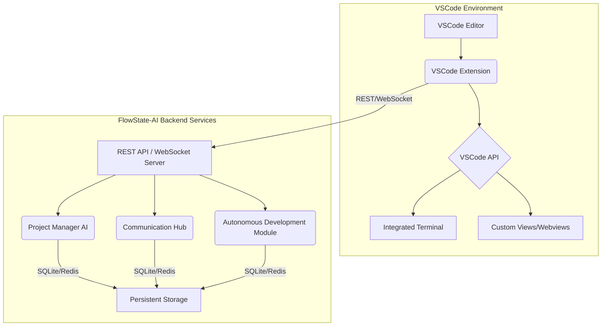

# VSCode Integration and Autonomous Control Modules Architecture

**Author**: Manus AI
**Date**: October 02, 2025

## 1. Introduction

This document outlines the architectural design for integrating the FlowState-AI system with Visual Studio Code (VSCode) to create a self-making development environment. The architecture focuses on enabling autonomous setup, development, error correction, and real-time monitoring within VSCode, leveraging the existing Project Manager AI, Communication Hub, and Autonomous Development modules. The goal is to transform VSCode into an intelligent, self-managing IDE that minimizes human intervention in the development lifecycle.

## 2. Overall Architecture

The VSCode integration will be achieved primarily through a dedicated VSCode extension. This extension will act as the bridge between the VSCode environment and the FlowState-AI's core AI agents. The architecture follows a client-server model where the VSCode extension (client) communicates with the FlowState-AI backend services (server), which host the Project Manager AI, Communication Hub, and Autonomous Development modules. This separation ensures that the heavy computational tasks of the AI agents are offloaded from the VSCode process, maintaining IDE responsiveness.

**Key Components:**

*   **VSCode Extension**: The primary interface within VSCode, responsible for UI interactions, command execution, and communication with the FlowState-AI backend.
*   **VSCode API**: The programmatic interface used by the extension to interact with the editor, file system, and UI elements [1].
*   **Integrated Terminal**: Used by the extension to execute shell commands for setup, dependency installation, and script execution.
*   **Custom Views/Webviews**: Utilized for displaying real-time dashboards, agent activity, and interactive feedback within VSCode.
*   **FlowState-AI Backend Services**: A set of services (likely Python-based, given the existing AI agents) exposing REST APIs and WebSocket endpoints for communication with the VSCode extension.
*   **Project Manager AI**: Orchestrates tasks, delegates to other agents, and manages the overall development plan [2].
*   **Communication Hub**: Facilitates inter-agent messaging, knowledge sharing, and collective decision-making [3].
*   **Autonomous Development Module**: Handles self-healing, continuous improvement, and autonomous feature development [4].
*   **Persistent Storage (SQLite/Redis)**: Databases for maintaining state, message history, agent performance, and knowledge base information.

## 3. Core VSCode Extension Components

The VSCode extension will be structured into several logical components, each responsible for a specific aspect of the autonomous system's integration:

### 3.1. Main Extension Controller

*   **Purpose**: Manages the lifecycle of the extension, handles activation events, and orchestrates interactions between other extension components.
*   **Responsibilities**: Initialization, command registration, event listeners, and communication channel setup.

### 3.2. Communication Layer

*   **Purpose**: Establishes and maintains communication with the FlowState-AI backend services.
*   **Responsibilities**: 
    *   **REST Client**: For synchronous requests (e.g., fetching task lists, agent status).
    *   **WebSocket Client**: For real-time updates (e.g., agent activity, task progress, alerts) from the Communication Hub and Project Manager AI.

### 3.3. UI Components

*   **Purpose**: Renders and manages custom UI elements within VSCode.
*   **Responsibilities**: 
    *   **Activity Bar View**: A dedicated view in the VSCode Activity Bar to display a summary of AI agent activity.
    *   **Webview Panel**: For the detailed real-time monitoring dashboard, offering rich visualizations and interactive elements.
    *   **Status Bar Item**: Displays concise system status or critical alerts.
    *   **Notifications**: Utilizes VSCode's notification API for important messages.

### 3.4. Automation Modules

*   **Purpose**: Encapsulates logic for performing autonomous actions within VSCode.
*   **Responsibilities**: 
    *   **Environment Setup Module**: Automates installation of extensions, dependencies, and configuration based on project requirements.
    *   **Code Manipulation Module**: Interacts with the VSCode editor to read, write, and modify code files.
    *   **Terminal Automation Module**: Executes commands in the integrated terminal and captures output.
    *   **File System Module**: Manages file and directory operations within the workspace.

## 4. Integration with AI Agents

The VSCode extension will integrate with the existing AI agents through the FlowState-AI backend services. This integration will enable a bidirectional flow of information and control.

### 4.1. Project Manager AI Integration

*   **Task Delegation**: The extension will receive task assignments from the PM AI and translate them into actionable VSCode operations (e.g., 

opening files, running tests).
*   **Progress Reporting**: The extension will report the progress and status of VSCode-centric tasks back to the PM AI via the backend API.
*   **Decision-Making**: When the PM AI initiates a voting process, the extension can display proposals to the user (if human intervention is required for critical decisions) or allow AI agents to cast votes programmatically.

### 4.2. Communication Hub Integration

*   **Inter-Agent Messaging**: The extension will subscribe to real-time message channels from the Communication Hub, allowing it to display messages, alerts, and status updates from other AI agents within VSCode.
*   **Knowledge Sharing**: Agents within VSCode can query the shared knowledge base or contribute new knowledge directly through the extension.
*   **Collaborative Recall**: If an AI agent within VSCode needs information, it can query the Communication Hub, which can then facilitate collaborative recall from other agents.

### 4.3. Autonomous Development Module Integration

*   **Self-Healing**: The extension will receive error diagnostics and suggested fixes from the Autonomous Development Module. It can then apply these fixes programmatically (e.g., modifying code, running shell commands) or prompt the user for approval if the confidence level is low.
*   **Continuous Improvement**: The extension can trigger code quality analysis and refactoring suggestions from the Autonomous Development Module, displaying them within VSCode for review or automated application.
*   **Feature Development**: When the Autonomous Development Module generates an implementation plan for a new feature, the extension can facilitate its execution by creating files, inserting code, and running necessary commands.

## 5. Autonomous Development Workflow within VSCode

The integrated system will enable a highly autonomous development workflow:

1.  **Project Initialization**: Upon cloning the FlowState-AI repository, the VSCode extension will detect the project and initiate autonomous setup. This includes installing required VSCode extensions, Node.js/Python dependencies, and configuring the environment [5].
2.  **Task Reception**: The extension receives tasks from the Project Manager AI, which are then translated into specific actions within VSCode.
3.  **Code Generation & Modification**: AI agents, through the extension, can generate new code, modify existing files, and apply refactorings based on task requirements.
4.  **Error Detection & Correction**: The Self-Healing system continuously monitors for errors (syntax, test failures, runtime issues). Detected errors are analyzed, and fixes are applied automatically or with user confirmation.
5.  **Continuous Improvement**: The Continuous Improvement system periodically analyzes the codebase, suggesting and applying optimizations to maintain code quality and efficiency.
6.  **Real-time Monitoring**: The VSCode dashboard provides a live view of all AI agent activities, task progress, and system health, ensuring transparency and oversight [6].
7.  **Version Control**: AI agents will automatically commit and push changes to the GitHub repository at frequent intervals, ensuring continuous version control and backups [7].

## 6. Self-Correction and Continuous Improvement Mechanisms

Within the VSCode environment, self-correction and continuous improvement will be integral to the autonomous system:

*   **Automated Testing and Validation**: After any code modification by an AI agent, automated tests will be triggered. If tests fail, the Self-Healing system will re-engage to diagnose and fix the new errors.
*   **Code Review by AI**: The Continuous Improvement system can perform automated code reviews, identifying areas for optimization or potential bugs, and suggesting improvements that can be applied programmatically.
*   **Feedback Loops**: Performance metrics from the Project Manager AI and communication patterns from the Communication Hub will inform the Autonomous Development Module, allowing it to refine its strategies for code generation, error fixing, and task execution.
*   **Learning from Failures**: The system will log all errors and successful fixes, building a knowledge base that improves its ability to diagnose and resolve similar issues in the future.

## 7. Conclusion

This architectural design provides a robust framework for integrating the FlowState-AI system with VSCode, creating a powerful, self-making development environment. By leveraging the VSCode Extension API and the capabilities of the Project Manager AI, Communication Hub, and Autonomous Development modules, the system will achieve unprecedented levels of autonomy, efficiency, and self-improvement in software development.

## 8. References

[1] VS Code API | Visual Studio Code Extension API. Available at: [https://code.visualstudio.com/api/references/vscode-api](https://code.visualstudio.com/api/references/vscode-api)
[2] Enhanced Project Manager AI (`project_manager_enhanced.py`). (Local File: `/home/ubuntu/Flowstate-AI/ai-gods/project_manager_enhanced.py`)
[3] Enhanced Communication Hub (`communication_hub_enhanced.py`). (Local File: `/home/ubuntu/Flowstate-AI/ai-gods/communication_hub_enhanced.py`)
[4] Autonomous Development Features (`autonomous_development.py`). (Local File: `/home/ubuntu/Flowstate-AI/ai-gods/autonomous_development.py`)
[5] GODMODE AI Local Development Setup. (Internal Knowledge Base).
[6] AI Agent Activity Monitoring Dashboard. (Internal Knowledge Base).
[7] Consolidated FlowState-AI Project Knowledge for Multi-Manus Collaboration. (Internal Knowledge Base).
