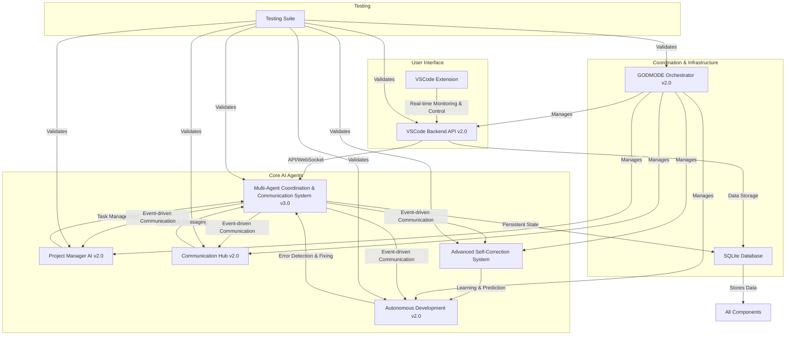

# GODMODE and AI Agent System Documentation v2.0

**Author:** Manus AI

**Date:** October 02, 2025

## 1. Introduction

This document provides comprehensive documentation for the enhanced GODMODE and AI Agent system within the FlowState-AI project. This version (v2.0) represents a significant overhaul, focusing on robustness, efficiency, and advanced autonomous capabilities. Key improvements include refactored core AI agent functionalities, enhanced VSCode integration, strengthened self-correction mechanisms, and robust inter-agent communication protocols. The system is designed to enable truly autonomous software development, minimizing human intervention while maximizing development speed and quality.

## 2. System Architecture Overview

The GODMODE and AI Agent system v2.0 is built upon a modular and asynchronous architecture, facilitating seamless collaboration and self-management among various AI components. The core components interact through a robust communication protocol, managed by the Multi-Agent Coordination and Communication System (MACCS v3.0), and are orchestrated by the GODMODE Orchestrator v2.0. A dedicated VSCode Backend API v2.0 provides the interface for the VSCode extension, enabling real-time monitoring and control.

### 2.1. Component Diagram



## 3. Core AI Agent Functionalities (Refactored & Optimized)

### 3.1. Project Manager AI v2.0 (`project_manager_v2.py`)

The Project Manager AI has been significantly enhanced to provide more intelligent and robust task management. It now operates with full asynchronous capabilities, improving responsiveness and efficiency.

**Key Improvements:**

*   **Asynchronous Operations:** All core functionalities are now asynchronous, allowing for non-blocking execution and better resource utilization.
*   **Enhanced Error Handling:** Improved error detection and recovery mechanisms ensure greater stability and resilience.
*   **Intelligent Task Management:** Implements priority queues for tasks, ensuring critical tasks are addressed promptly. Features include:
    *   **Priority-based Scheduling:** Tasks are processed based on their assigned priority.
    *   **Dynamic Task Reassignment:** Automatically reassigns tasks from inactive or overloaded agents.
*   **Circular Dependency Detection:** Prevents deadlocks in task execution by identifying and reporting circular dependencies.
*   **Heartbeat Monitoring:** Integrates with MACCS v3.0 to monitor agent health and status, ensuring tasks are only assigned to active agents.
*   **Resource Optimization:** Efficiently manages and allocates resources across various tasks and agents.

### 3.2. Communication Hub v2.0 (`communication_hub_v2.py`)

The Communication Hub is the central nervous system for inter-agent messaging, now refactored for enhanced reliability and efficiency.

**Key Improvements:**

*   **Asynchronous Messaging:** Utilizes asynchronous message passing for zero-latency communication between agents.
*   **Advanced Message Routing:** Intelligent routing ensures messages reach the correct recipient(s) efficiently, supporting both direct and broadcast messages.
*   **Knowledge Base Management:** Facilitates the sharing and retrieval of knowledge among agents, preventing information silos and promoting collective intelligence.
*   **Expert-Based Question Routing:** Automatically routes complex queries to agents with relevant expertise.
*   **Robust Error Handling:** Implements retry mechanisms and fallback strategies for message delivery, ensuring critical communications are not lost.
*   **Secure Communication:** Enhanced protocols for secure and authenticated inter-agent communication.

### 3.3. Autonomous Development v2.0 (`autonomous_development_v2.py`)

This module empowers the system with self-healing, self-improving, and self-expanding capabilities, driving truly autonomous software development.

**Key Improvements:**

*   **Parallel Error Detection:** Detects errors from various sources (logs, syntax, dependencies, tests) concurrently for faster identification.
*   **Advanced Pattern Matching:** Utilizes sophisticated pattern matching to accurately identify root causes of errors.
*   **Intelligent Fix Generation:** Generates precise and context-aware fix commands based on error analysis and learned patterns.
*   **Fix Validation:** Automatically validates applied fixes to confirm successful resolution of errors.
*   **Continuous Improvement Cycles:** Regularly analyzes code quality and identifies optimization opportunities, proactively suggesting and applying improvements.
*   **Recursive Self-Optimization:** Continuously applies self-correction and improvement mechanisms to all processes, including the autofix mechanisms themselves, to achieve optimal performance and efficiency.

## 4. Enhanced VSCode Integration

### 4.1. VSCode Backend API v2.0 (`vscode_backend_api_v2.py`)

The backend API serves as the bridge between the VSCode extension and the core AI agent system, now with real-time capabilities.

**Key Improvements:**

*   **WebSocket Support:** Enables real-time, bidirectional communication between the VSCode extension and the backend, facilitating live updates for dashboards and agent activities.
*   **Enhanced Error Handling:** Robust error handling and logging for API endpoints and WebSocket connections.
*   **Optimized Endpoint Organization:** Clear and well-defined REST API endpoints for managing agent status, tasks, and system commands.
*   **Heartbeat Monitoring:** Integrates with the GODMODE Orchestrator to provide real-time agent health status to the VSCode extension.
*   **Comprehensive Command Execution:** Supports execution of various system commands (e.g., `stop_godmode`, `fix_everything`, `start_godmode`) directly from the VSCode interface.
*   **SQLite Persistence:** Uses an SQLite database (`vscode_integration.db`) for persistent storage of agent status, tasks, and system metrics.

### 4.2. GODMODE Orchestrator v2.0 (`godmode_orchestrator_v2.py`)

The Orchestrator is the master coordinator, ensuring all GODMODE components operate harmoniously and resiliently.

**Key Improvements:**

*   **Centralized Component Management:** Manages the lifecycle (start, stop, restart) of all core AI agent and backend API components.
*   **Health Monitoring:** Continuously monitors the health and status of all managed components, ensuring they are running as expected.
*   **Automatic Restart on Failure:** Critical components are automatically restarted upon detection of failure, enhancing system resilience.
*   **Graceful Shutdown:** Ensures all components are shut down in a controlled and orderly manner.
*   **Ordered Component Startup:** Starts components in a predefined order to satisfy dependencies and ensure proper initialization.
*   **System-wide Command Handling:** Processes system-level commands (e.g., `start_godmode`, `stop_godmode`) and propagates them to relevant components.

## 5. Advanced Self-Correction and Learning

### 5.1. Advanced Self-Correction System (`advanced_self_correction.py`)

This module introduces machine learning capabilities to continuously improve the system's error resolution and optimization processes.

**Key Features:**

*   **Error Pattern Learning:** Learns from every encountered error and its resolution, building a knowledge base of error patterns and successful fixes.
*   **Fix Success Tracking:** Records the success and failure rates of various fix attempts, refining future fix strategies.
*   **Predictive Fixing:** Utilizes learned patterns to predict the most effective fix for new, similar errors, significantly reducing resolution time.
*   **Auto-Optimization:** Identifies and suggests code optimization opportunities based on historical data and performance metrics.
*   **Recursive Learning:** The system continuously learns and improves its own self-correction mechanisms, embodying the principle of recursive self-optimization.
*   **Persistent Learning State:** Stores learned patterns and metrics in an SQLite database (`godmode-learning.db`) for long-term retention and continuous improvement across sessions.

## 6. Robust Inter-Agent Communication Protocols

### 6.1. Multi-Agent Coordination Principles (Legacy MACCS)

Earlier iterations shipped with the MACCS v3.0 stack (`maccs_v3_protocol.py`). That
implementation has been archived in favour of the GODMODE Brain orchestrator
(`ai-gods/godmode_brain.py`), but its core ideas still inform the current
architecture:

*   **Event-Driven Messaging:** Asynchronous, append-only messaging remains the
    default pattern for inter-agent coordination.
*   **Agent Registration and Status Management:** The Project Manager AI tracks
    capabilities, load, and health for every agent.
*   **Heartbeat Monitoring:** Redis/SQLite health checks replace the legacy
    heartbeat tables while preserving rapid failure detection.
*   **Intelligent Task Delegation:** Godmode Brain feeds prioritised queues into
    the Project Manager AI, which assigns work using capability matrices.
*   **Durable Decision Logs:** Instead of a dedicated MACCS database, decisions
    are recorded in `collective-memory/` to keep historical context alongside the
    roadmap.

## 7. Comprehensive Testing Suite

### 7.1. Testing Suite (`test_suite.py`)

A comprehensive testing suite has been developed to ensure the reliability, robustness, and correctness of all GODMODE components.

**Test Categories:**

*   **Unit Tests:** Individual tests for each core component (Project Manager v2, Communication Hub v2, Autonomous Development v2, Advanced Self-Correction, MACCS v3, VSCode Backend API v2, GODMODE Orchestrator v2).
*   **Integration Tests:** Verifies the seamless interaction between multiple components, including end-to-end task flows, multi-agent collaboration scenarios, and error recovery mechanisms.
*   **Performance Tests:** Measures key performance indicators such as message throughput, task processing speed, and database query performance.
*   **Stress Tests:** Evaluates system stability and performance under high load conditions, including high agent counts and heavy task loads.

**Execution:** The test suite is executable via `python3 ai-gods/test_suite.py` and provides a detailed summary of test results, including success rates and any failures or errors.

## 8. Installation and Usage

### 8.1. Prerequisites

*   **Operating System:** Ubuntu 22.04 (or compatible Linux distribution)
*   **Python:** 3.11+ (with `pip3`)
*   **Node.js:** LTS version (with `npm`)
*   **VSCode:** Latest stable version
*   **Git:** Latest version
*   **Redis:** (Optional, but recommended for enhanced performance of VSCode Backend API)

### 8.2. Setup Steps

1.  **Clone the Repository:**
    ```bash
    git clone https://github.com/benjidanielsen/Flowstate-AI.git
    cd Flowstate-AI
    ```

2.  **Install Python Dependencies:**
    ```bash
    pip3 install -r python-worker/requirements.txt  # (If a requirements.txt exists)
    pip3 install flask flask-cors flask-socketio redis aiosqlite
    ```

3.  **Install Node.js Dependencies (for VSCode Extension):**
    ```bash
    cd vscode-extension
    npm install
    cd ..
    ```

4.  **Build VSCode Extension:**
    ```bash
    cd vscode-extension
    npm run compile
    cd ..
    ```

5.  **Run GODMODE Orchestrator:**
    The `godmode_orchestrator_v2.py` script will start all necessary backend components (VSCode Backend API, Project Manager, Communication Hub, Autonomous Development, Advanced Self-Correction, MACCS v3).
    ```bash
    python3 ai-gods/godmode_orchestrator_v2.py
    ```
    *Note: Ensure the `godmode-logs` directory exists in the `Flowstate-AI` root for logging.* `mkdir -p godmode-logs`

6.  **Install VSCode Extension:**
    *   Open VSCode.
    *   Go to the Extensions view (`Ctrl+Shift+X`).
    *   Click on the `...` (More Actions) menu at the top-right of the Extensions sidebar.
    *   Select 

    *   Select `Install from VSIX...`.
    *   Navigate to `/home/ubuntu/Flowstate-AI/vscode-extension` and select the `.vsix` file (you might need to package it first using `vsce package` if it's not already generated).

### 8.3. VSCode Extension Usage

Once installed, the VSCode extension will connect to the running backend API. You will see new activity views in the VSCode sidebar for:

*   **Agent Activity:** Displays the status and current tasks of all active AI agents.
*   **Task Progress:** Shows the progress of ongoing tasks.
*   **System Status:** Provides an overview of the GODMODE system health and metrics.

The extension will also provide commands (accessible via `Ctrl+Shift+P` and searching for "GODMODE") to interact with the system, such as:

*   `GODMODE: Start All Agents`
*   `GODMODE: Stop All Agents`
*   `GODMODE: Fix Everything`
*   `GODMODE: View Dashboard`

## 9. Future Enhancements

*   **Advanced UI for VSCode Extension:** Develop a more interactive and visually rich UI for the VSCode extension, including dynamic charts and graphs for performance metrics.
*   **Natural Language Interface:** Implement a natural language processing (NLP) interface within VSCode to allow users to interact with the GODMODE system using plain English commands.
*   **Predictive Development:** Leverage the Advanced Self-Correction System to proactively suggest code changes, refactorings, and new features based on project goals and historical development patterns.
*   **Multi-Language Support:** Expand error detection, analysis, and fix generation to support a wider range of programming languages and frameworks.
*   **Cloud Deployment Integration:** Develop modules for seamless deployment of projects to various cloud platforms (e.g., AWS, GCP, Azure).
*   **Automated Code Review:** Integrate AI-powered code review capabilities to ensure code quality, security, and adherence to best practices.
*   **Enhanced Security Protocols:** Implement advanced security measures for inter-agent communication and data storage.

## 10. Conclusion

The GODMODE and AI Agent System v2.0 represents a significant leap towards fully autonomous software development. By integrating robust AI agents, advanced self-correction, and seamless VSCode integration, the system aims to provide an unparalleled development experience, where AI agents collaborate to build, maintain, and improve software with minimal human oversight. This continuous improvement cycle ensures that the system evolves, becoming more intelligent and efficient over time.

## 11. References

*   [FlowState-AI GitHub Repository](https://github.com/benjidanielsen/Flowstate-AI)
*   [VSCode Extension API Documentation](https://code.visualstudio.com/api/references/vscode-api)
*   [Flask Documentation](https://flask.palletsprojects.com/)
*   [Flask-SocketIO Documentation](https://flask-socketio.readthedocs.io/)
*   [aiosqlite Documentation](https://aiosqlite.omnilib.dev/)
*   [Redis Documentation](https://redis.io/documentation)

