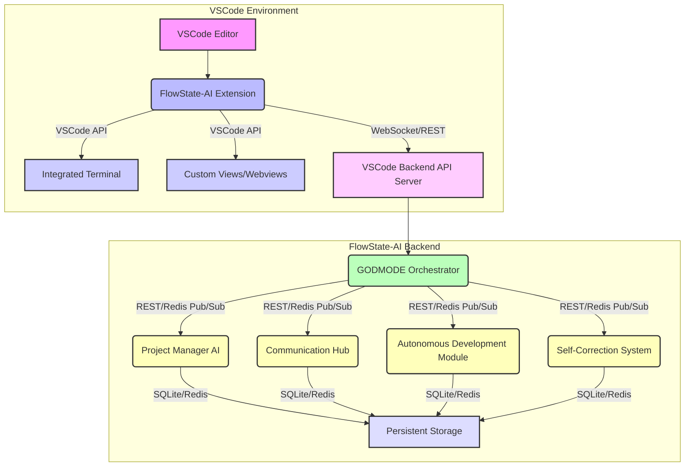

# FlowState-AI GODMODE: Self-Making VSCode System Documentation

**Author**: Manus AI
**Date**: October 02, 2025

## 1. Introduction

This document provides comprehensive documentation for the **FlowState-AI GODMODE: Self-Making VSCode System**. This system transforms Visual Studio Code into an autonomous, AI-driven development environment capable of self-setup, continuous development, and error correction with minimal human intervention. It integrates existing FlowState-AI agents (Project Manager, Communication Hub, Autonomous Development) to create a seamless and highly efficient development workflow.

The primary goal of this system is to provide a "cheatcode" or "GODMODE" experience, allowing developers to focus on high-level objectives while the AI handles the intricate details of coding, environment management, and problem-solving. The system is designed to be self-healing, self-optimizing, and continuously improving, embodying the vision of a truly autonomous development paradigm.

## 2. System Architecture

The FlowState-AI GODMODE system for VSCode operates on a client-server architecture, where a dedicated VSCode extension acts as the client, communicating with a Python-based backend API server. This backend server orchestrates the various FlowState-AI agents and their functionalities.

### 2.1 High-Level Overview



### 2.2 Component Breakdown

*   **FlowState-AI VSCode Extension**: The client-side component installed in VSCode. It provides the user interface, interacts with the VSCode API for editor control, and communicates with the backend server via REST and WebSockets.
    *   **`extension.ts`**: The main entry point, handling activation, command registration, and initialization of other modules.
    *   **`communicationManager.ts`**: Manages HTTP (Axios) and WebSocket (`ws`) communication with the backend API, handling real-time updates and command sending.
    *   **`environmentSetup.ts`**: Automates the installation of VSCode extensions, Node.js/Python dependencies, database setup, and workspace configuration.
    *   **`codeManipulation.ts`**: Provides functionalities for programmatic file creation, modification, deletion, code insertion, and replacement within the VSCode editor.
    *   **`terminalAutomation.ts`**: Enables execution of shell commands, npm scripts, Python scripts, and Git operations within the integrated terminal.
    *   **`dashboardProvider.ts`**: Renders the main interactive dashboard within a VSCode Webview panel, displaying real-time agent activity, task progress, and system status.
    *   **`agentActivityProvider.ts`, `taskProgressProvider.ts`, `systemStatusProvider.ts`**: Tree data providers for the VSCode Activity Bar, offering concise views of agent status, task progress, and overall system health.

*   **VSCode Backend API Server (`vscode_backend_api.py`)**: A Flask-based Python server that acts as the central communication hub for the VSCode extension and the FlowState-AI agents. It exposes REST endpoints for data retrieval and command execution, and uses Redis Pub/Sub for real-time messaging.
    *   **Endpoints**: Provides APIs for agent status updates, task management, system status, and command execution (e.g., `stop_godmode`, `fix_everything`).
    *   **Data Persistence**: Uses SQLite (`vscode_integration.db`) for persistent storage of agent status, tasks, and system metrics. Redis is used for real-time message broadcasting.

*   **VSCode Agent Integration Module (`vscode_agent_integration.py`)**: A Python module designed to be imported and used by individual FlowState-AI agents. It simplifies interaction with the VSCode Backend API, allowing agents to:
    *   Register and update their status.
    *   Create and update tasks.
    *   Listen for commands from the VSCode extension.
    *   Send code manipulation requests to the extension.
    *   Send terminal commands to the extension.
    *   Send notifications to VSCode.

*   **VSCode Self-Correction System (`vscode_self_correction.py`)**: This Python module implements the core self-healing and continuous improvement mechanisms. It operates by:
    *   **Error Detection**: Checks for TypeScript compilation errors, Python syntax errors, missing dependencies, runtime errors in logs, and test failures.
    *   **Fix Generation**: Analyzes detected errors and generates appropriate fixes (e.g., installing missing packages, suggesting code changes).
    *   **Fix Application**: Applies fixes by sending commands or code manipulation requests via the `vscode_agent_integration` module.
    *   **Fix Validation**: Verifies that applied fixes have resolved the original errors.
    *   **Code Quality Analysis**: Periodically analyzes codebase metrics (e.g., lines of code, file sizes) and identifies optimization opportunities.

*   **VSCode GODMODE Orchestrator (`vscode_godmode_orchestrator.py`)**: The master Python script that starts and manages all components of the self-making VSCode system. It:
    *   Registers itself as an agent.
    *   Starts the VSCode Backend API server and the Self-Correction System.
    *   Runs a continuous orchestration loop, performing health checks, coordinating agents, managing tasks, and monitoring performance.
    *   Handles graceful shutdown of the system.

*   **Existing FlowState-AI Agents**: The Project Manager AI, Communication Hub, and Autonomous Development Module (as enhanced in previous phases) will integrate with this system using the `vscode_agent_integration.py` module to report their status, receive commands, and execute actions within the VSCode environment.

## 3. Installation and Setup

To set up the FlowState-AI GODMODE: Self-Making VSCode System, follow these steps:

### 3.1 Prerequisites

Ensure you have the following installed on your system:

*   **Git**: For cloning the repository.
*   **Node.js (LTS version) and npm**: For the VSCode extension development and frontend dependencies.
*   **Python (3.11+) and pip**: For the backend API and AI agents.
*   **VSCode**: The editor itself.
*   **Redis Server**: The backend API uses Redis for real-time communication. Ensure a Redis server is running locally (e.g., via Docker or a native installation).

### 3.2 Clone the Repository

First, clone the FlowState-AI GitHub repository to your local machine:

```bash
git clone https://github.com/benjidanielsen/Flowstate-AI.git
cd Flowstate-AI
```

### 3.3 VSCode Extension Setup

1.  **Navigate to the extension directory**:
    ```bash
    cd vscode-extension
    ```

2.  **Install Node.js dependencies**: This will install all required packages for the VSCode extension, including TypeScript and VSCode API types.
    ```bash
    npm install
    ```

3.  **Compile the TypeScript code**: This will transpile the TypeScript source files into JavaScript, which VSCode can execute.
    ```bash
    npm run compile
    ```

4.  **Open the project in VSCode**: Open the entire `Flowstate-AI` folder in VSCode.

5.  **Run the Extension in Development Mode**: In VSCode, go to the Run and Debug view (Ctrl+Shift+D or Cmd+Shift+D), select "Run Extension" from the dropdown, and click the green play button. This will open a new VSCode window with the FlowState-AI GODMODE extension activated.

### 3.4 Backend API and AI Agents Setup

1.  **Install Python dependencies**: From the root of the `Flowstate-AI` directory, install the Python dependencies for the AI agents and the backend API.
    ```bash
    pip install -r python-worker/requirements.txt
    pip install flask flask-cors redis requests
    ```

2.  **Start the VSCode Backend API Server**: Open a new terminal (or use the integrated terminal in VSCode) from the `Flowstate-AI/ai-gods` directory and run the backend API server:
    ```bash
    cd ai-gods
    python3 vscode_backend_api.py
    ```
    You should see output indicating the server is listening on `http://localhost:3001`.

3.  **Start the GODMODE Orchestrator**: Open another terminal from the `Flowstate-AI/ai-gods` directory and run the orchestrator. This will start the self-correction system and coordinate other agents.
    ```bash
    cd ai-gods
    python3 vscode_godmode_orchestrator.py
    ```

## 4. Usage

Once the VSCode extension is running and the backend services are active, you can interact with the FlowState-AI GODMODE system through VSCode.

### 4.1 VSCode Commands

Access these commands via the VSCode Command Palette (Ctrl+Shift+P or Cmd+Shift+P) and search for "FlowState-AI":

*   **`FlowState-AI: Start GODMODE`**: Initiates the GODMODE orchestrator and activates the autonomous development cycle. This will also open the dashboard.
*   **`FlowState-AI: Stop GODMODE`**: Gracefully shuts down the GODMODE orchestrator and associated AI agents.
*   **`FlowState-AI: Show Dashboard`**: Opens the real-time monitoring dashboard in a Webview panel.
*   **`FlowState-AI: Setup Environment`**: Triggers the autonomous environment setup process, installing extensions, dependencies, and configuring the workspace.
*   **`FlowState-AI: Fix Everything`**: Initiates the self-healing mechanism to detect, diagnose, and fix any detected errors in the project.

### 4.2 Real-time Monitoring Dashboard

The dashboard provides a comprehensive overview of the autonomous system:

*   **Access**: Open via the `FlowState-AI: Show Dashboard` command or automatically when GODMODE starts.
*   **Sections**:
    *   **Header**: Contains quick action buttons (`Start GODMODE`, `Stop`, `Fix Everything`, `Refresh`).
    *   **Stats**: Displays key metrics like Active Agents, Tasks Queued, Tasks Completed, and overall System Status.
    *   **AI Agent Activity**: Lists all active AI agents, their current tasks, status, and progress percentages.
    *   **Task Progress**: Shows a list of recent tasks and their statuses.
*   **Updates**: The dashboard updates in real-time via WebSocket communication with the backend.

### 4.3 Activity Bar Views

Three dedicated views are available in the VSCode Activity Bar (look for the FlowState-AI icon):

*   **AI Agent Activity**: A tree view showing the status and current task of each AI agent.
*   **Task Progress**: A tree view summarizing the status of tasks (In Progress, Queued, Completed, Failed).
*   **System Status**: Displays overall system health, active agent count, and task counts.

### 4.4 Configuration

You can configure the extension settings via VSCode Settings (Ctrl+, or Cmd+,) and searching for "FlowState-AI":

*   **`flowstate-ai.backendUrl`**: URL of the FlowState-AI backend API (default: `http://localhost:3001`).
*   **`flowstate-ai.websocketUrl`**: WebSocket URL for real-time updates (default: `ws://localhost:3001`).
*   **`flowstate-ai.autoSetup`**: If `true`, the environment setup will run automatically when a FlowState-AI project is detected.
*   **`flowstate-ai.autoFix`**: If `true`, fixes suggested by the self-healing system will be applied automatically without confirmation.

## 5. AI Agent Integration

The existing FlowState-AI agents are integrated into this VSCode system through the `vscode_agent_integration.py` module and the backend API. This allows for:

*   **Centralized Status Reporting**: Agents report their status, current tasks, and progress to the backend, which is then reflected in the VSCode dashboard.
*   **Command Execution**: The VSCode extension can send commands (e.g., `stop_godmode`, `fix_everything`) to the backend, which are then relayed to the relevant AI agents.
*   **Code Manipulation**: AI agents can programmatically request file operations (create, modify, delete, insert, replace code) within the VSCode workspace.
*   **Terminal Interaction**: Agents can execute shell commands directly in the VSCode integrated terminal.
*   **Communication Hub**: The Communication Hub facilitates inter-agent messaging and knowledge sharing, with updates potentially visible in VSCode notifications or dedicated views.

## 6. Self-Correction and Continuous Improvement

At the heart of the GODMODE system are its self-correction and continuous improvement mechanisms, primarily driven by the `vscode_self_correction.py` module and orchestrated by the `vscode_godmode_orchestrator.py`.

### 6.1 Self-Healing

The system continuously monitors for various types of errors:

*   **Code Errors**: TypeScript compilation errors, Python syntax errors.
*   **Dependency Issues**: Missing Node.js or Python packages.
*   **Runtime Problems**: Errors detected in application logs.
*   **Test Failures**: Automated detection of failing tests.

Upon detecting an error, the system attempts to:

1.  **Diagnose**: Identify the root cause of the error.
2.  **Generate Fix**: Propose a solution (e.g., `npm install`, `pip install`, code modification).
3.  **Apply Fix**: Execute the proposed fix using the `codeManipulation` or `terminalAutomation` modules.
4.  **Validate Fix**: Re-check if the error has been resolved. If not, it may escalate or try alternative fixes.

### 6.2 Continuous Improvement

Beyond error correction, the system actively seeks to improve the codebase and development process:

*   **Code Quality Analysis**: Periodically assesses code metrics (e.g., lines of code, file complexity) to identify areas for refactoring.
*   **Optimization Opportunities**: Flags large files, potential code duplication, or inefficient patterns, suggesting improvements.
*   **Automated Refactoring**: Can apply minor refactorings automatically or suggest them for developer review.
*   **Dependency Optimization**: Manages project dependencies to ensure only necessary packages are installed.

## 7. Conclusion

The FlowState-AI GODMODE: Self-Making VSCode System represents a significant advancement in autonomous software development. By seamlessly integrating AI agents with the VSCode environment, it aims to create a highly efficient, self-managing, and continuously evolving development platform. This system empowers developers to achieve unprecedented productivity and focus on innovation, leaving the routine and error-prone tasks to the intelligent automation of FlowState-AI. Enjoy the GODMODE experience!
