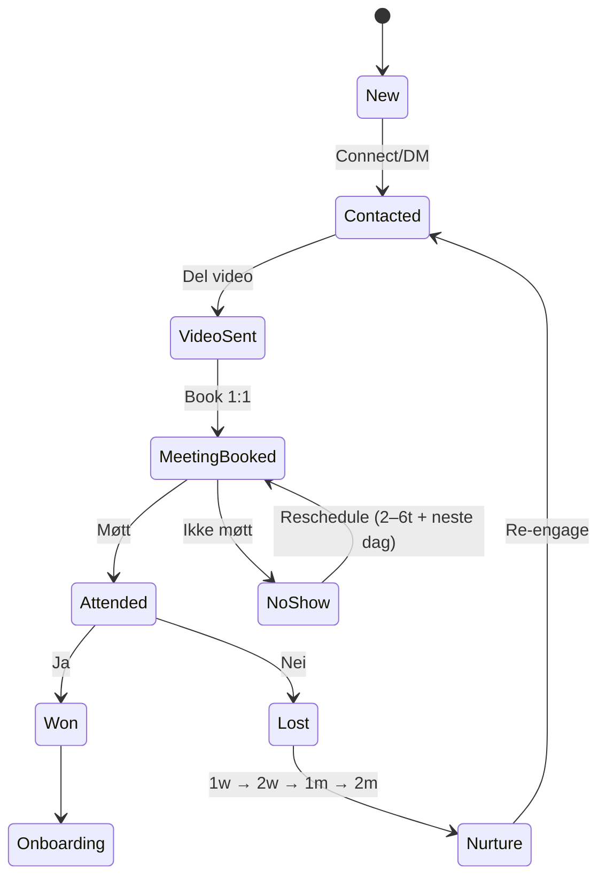

# AI WORK ORDER — Zero‑Based, Verktøy‑Agnostisk NWM/CRM (Pro Builder Edition)

> **Formål:** Dette dokumentet er en profesjonell **AI‑arbeidsordre / master‑prompt** som produkt- og systemutviklere kan lime inn i en avansert LLM (f.eks. Gemini) for å få AI til å **analysere, designe, simulere, kvalitetssikre og iterere** et komplett NWM/CRM‑system – uten å låse til konkrete verktøy. Skissen *Connect → Video → Intro → Beslutning → Onboarding* og andre flyter er **kun inspirasjon**, ikke fasit.

---

## 0) Roller, modus og prinsipper
- **Rolle:** Handle som *Principal System Architect + Product Lead* for et NWM/CRM‑system. 
- **Modus:** **Zero‑based design** – tenk fra blanke ark med alle tilgjengelige kilder. 
- **Verktøy‑agnostisk:** Ikke bind løsninger til spesifikke produkter. Beskriv **funksjon/atferd** og alternative arkitekturvalg med trade‑offs.
- **IPA‑først:** Optimalisér for **minst mulig tid til IPA** (InntektsProduserende Aktivitet). 
- **3‑klikk‑regelen:** Brukeren skal nå “Neste oppgave” på **≤ 3 klikk**.
- **Team‑dupliserbarhet:** Løsningen må kunne kopieres til pods/teams med minimal konfig.
- **Språk/locale:** Norsk. Tidssone: **Europe/Oslo**.

---

## 1) Omfang (In/Out) og antakelser
**In scope:**
- Funksjonell spesifikasjon, datamodell, tilstandsmaskiner, brukerreiser, automatiseringsregler, scoring & **Next Best Action**, meldingsbibliotek‑krav, KPI‑rammeverk, eksperimenter, akseptkriterier, testplan, roadmap, alternativer A/B/C.
- Simulering, what‑ifs, risikologg, forslag til operasjonelle rutiner.

**Out of scope:**
- Valg/konfig av konkrete produkter (Airtable/Make/CRM X osv.).
- Juridisk rådgivning (kun flagging av risiko på høyt nivå).

**Antakelser (fyll ut/justér):**
- Mål per dag: **20 nye kontakter** + **30 oppfølginger**. 
- Webinar/intro‑cadence finnes; kalender brukes aktivt.
- Compliance: inntekts‑disclaimer, reklame‑merking, samtykke/opt‑out håndteres høy‑nivå.

---

## 2) Domene, begreper og datamodell
### 2.1 Begreper (eksempler – AI skal utvide/justere)
DMO/IPA, Pipeline, Status, Follow‑up, No‑show, Score, Win/Loss, Pod/Team, Onboarding, Retensjon.

### 2.2 Canonical Entities (funksjonelt)
- **Prospect**, **Activity**, **Appointment**, **FollowUp**, **Note**, **Status**, **Score**, **User**, **Team/Pod**, **Goal/Habit**, **Deal(Win/Loss)**.

### 2.3 JSON‑skjemaer (eksempel — AI kan endre/utvide)
```json
{
  "$schema": "https://json-schema.org/draft/2020-12/schema",
  "$id": "Prospect.schema.json",
  "type": "object",
  "required": ["id", "fullName", "primaryChannel", "status", "createdAt"],
  "properties": {
    "id": { "type": "string" },
    "fullName": { "type": "string", "minLength": 1 },
    "primaryChannel": { "type": "string", "enum": ["Messenger","IG","SMS","Email","Other"] },
    "tags": { "type": "array", "items": { "type": "string" } },
    "status": { "type": "string", "enum": ["New","Contacted","VideoSent","MeetingBooked","Attended","NoShow","Won","Lost","Nurture"] },
    "interestScore": { "type": "integer", "minimum": 1, "maximum": 5 },
    "relationshipScore": { "type": "integer", "minimum": 1, "maximum": 5 },
    "priority": { "type": "string", "enum": ["A","B","C"] },
    "ownerId": { "type": "string" },
    "notes": { "type": "string" },
    "createdAt": { "type": "string", "format": "date-time" },
    "updatedAt": { "type": "string", "format": "date-time" }
  }
}
```

```json
{
  "$schema": "https://json-schema.org/draft/2020-12/schema",
  "$id": "Activity.schema.json",
  "type": "object",
  "required": ["id", "prospectId", "type", "timestamp"],
  "properties": {
    "id": { "type": "string" },
    "prospectId": { "type": "string" },
    "type": { "type": "string", "enum": ["Connect","MessageSent","VideoShared","Reminder","Meeting","FollowUp","SystemPing","StatusChange"] },
    "metadata": { "type": "object" },
    "timestamp": { "type": "string", "format": "date-time" }
  }
}
```

### 2.4 Tilstandsmaskin (lead lifecycle)


---

## 3) Brukerreiser (min. 3 — eksempler, AI skal lage egne varianter)
1) **Connect → Video → Intro (1:1) → Beslutning → Onboarding** *(inspirasjon)*  
2) **Webinar:** Invitasjon → Deltakelse → Oppfølging → Konvertering *(inspirasjon)*  
3) **Retensjon:** 30‑d oppfølging → Community → Ambassadør *(inspirasjon)*  
4) **AI skal levere egne nye varianter**, f.eks. *Content‑first*, *Scheduler‑first*, *Community‑first* med triggere, milepæler, beslutningspunkter, forventede utfall og diagrammer.

---

## 4) Automatiseringsregler (plattform‑nøytrale)
- **No‑show:** Oppfølging samme dag etter **2–6t**, + neste dag **12:00/16:00** (Europe/Oslo). 
- **Video sendt:** Sjekk etter ~**24t** (tilpass etter utsendingstid). 
- **“Nei takk”/kaldt:** 1 uke → 2 uker → 1 mnd → 2 mnd (nedprioriter, ikke slett).
- **IPA‑coach:** Dagens mål **20/30**, **morgenbrief 08:00**, **4–6 mikropinger**/dag.
- **Kalenderforståelse:** Matche møtetitler (f.eks. “Intro – [Navn]”) til riktig prospect og trigge riktig oppfølging.

---

## 5) Scoring & Next Best Action (NBA)
- **Interesse (1–5)**, **Relasjon (1–5)** → **Prioritet (A/B/C)**. 
- **Decay/forfall:** score faller over tid uten aktivitet. 
- **NBA‑kø:** deterministisk rekkefølge med tie‑breakers (aldersstempel, show‑sannsynlighet, avtalt SLA). 
- **Mål:** minimere tid til neste verdifulle handling og redusere kognitiv last.

---

## 6) Ikke‑funksjonelle krav (NFR) og budsjett
- **Ytelse:** *Tid til “Neste oppgave”* ≤ **3 klikk** og ≤ **10 sek**. 
- **Pålitelighet:** SLO *NBA‑beregning* p95 < **1s**; *påminnelser* leveres p99 innen **±2 min**.
- **Kost/ressurser:** Definér kosttak og rate‑limits; AI‑kall skal ha budsjett og fallback.
- **Sikkerhet/Personvern:** Minimer PII; begrens tilgang; audit‑logg; samtykke/opt‑out‑rutiner.
- **Tilgjengelighet:** Lesbarhet, tastaturnavigasjon, fargekontrast (WCAG indikativt).
- **Lokalitet:** Europe/Oslo; helger/helligdager hensyntas i planlegging.

---

## 7) Observability & drift
- **Eventlogg:** hver statusendring/follow‑up → strukturert event (med `correlationId`, `actor`, `prospectId`).
- **Sporbarhet:** endringers *hvem/hva/når/hvorfor*. 
- **Runbooks:** No‑show storm, duplikater, kalenderfeil, API‑feil, kø‑stopp.
- **Feature flags:** trygge endringer; **rollback**‑prosedyrer; idempotenskrav.

---

## 8) Compliance (høy‑nivå)
- **Inntekts‑disclaimer** og **reklame‑merking** der relevant.
- **GDPR:** samtykke, dataportabilitet, rett til sletting, **dataretensjon**‑policy.
- **Anti‑spam:** kontaktfrekvens og kanalpreferanser respekteres.

---

## 9) Test & verifikasjon
### 9.1 Akseptkriterier
- Bruker når “Neste oppgave” på ≤ 3 klikk og ≤ 10 sek i p95.
- No‑show‑regler utløses korrekt (2–6t + neste dag), video‑sjekk ~24t.
- NBA‑kø prioriterer korrekt etter definert scoring/tie‑breakers.

### 9.2 Testplan
- **UAT‑scenarier:** nybegynner (“rookie‑proof”), erfaren bruker, høy volumdag. 
- **What‑ifs:** ingen svar, feil kalender, duplikater, *no‑show*, usikker interesse.
- **Testdata:** syntetiske CSV/JSON (1000 leads) med edge‑cases.

### 9.3 Simuleringskrav
- **E2E‑simulering** “dag i livet” med målinger: klikk, sekunder, manuelle beslutninger frem til første IPA. 
- **Effektmatrise:** Tid‑til‑IPA, kognitiv last, feilrisiko, compliance‑risiko, skalerbarhet, ramp‑up, datadekning.
- **Pareto‑kutt:** foreslå endringer som sparer ≥ **20%** tid; vis **før/etter**‑tabell.

---

## 10) Alternativer & roadmap
- **Tre varianter (A/B/C)**: *Safe‑Minimal*, *Aggressive*, *Radical* — med trade‑offs (resultat, kompleksitet, vedlikehold).
- **Anbefaling:** velg én default og begrunn. 
- **Roadmap 30/60/90:** v1 (MVP), v1.1 (stabilitet), v2 (skala/AI‑assistanse).

---

## 11) Leveranseformat (krav)
1. **Executive summary** (10–12 punkter).  
2. **Issue‑log** (Problem • Alvorlighet • Fix • Status).  
3. **Målarkitektur** (+ sekvens/tilstandsdiagrammer).  
4. **Datamodell** (JSON‑skjemaer) + **tilstandsmaskin**.  
5. **Minst 3 brukerreiser** (inkl. AI‑skapte varianter).  
6. **Automatiseringsregler** (timere/betingelser/re‑prioritering).  
7. **Scoring & NBA** (regler/algoritme).  
8. **Meldingsbibliotek‑krav** (struktur/variabler).  
9. **NFR/SLI/SLO**, observability, security & privacy.  
10. **Akseptkriterier, testplan, simuleringsrapport**.  
11. **Alternativer A/B/C**, **anbefaling**, **roadmap**.  
12. **Risiko‑register** og **ADR** (Architecture Decision Records).

---

## 12) Operatør‑kommandoer for iterasjon
Bruk disse hver gang du vil at AI skal validere/forbedre:

**Global Re‑check v{N}:**
1) Simulér E2E med syntetiske data; mål klikk/sekunder til første IPA.  
2) Effektmatrise; identifisér topp 5 flaskehalser.  
3) Pareto‑kutt ≥20% tid; vis før/etter.  
4) A/B/C med trade‑offs + anbefaling.  
5) Stoppljus: 🟢/🟡/🔴 + *Go/No‑Go* kriterier.  
6) Hvis ikke 🟢: **Neste Iterasjon Plan** (endringer + ny tid‑til‑IPA).  
*(Hold alt verktøy‑agnostisk.)*

**Oppfølgere (eksempler):**
- “Hvor taper vi flest sekunder – kan det steget fjernes helt?”
- “Gi versjonen med færrest manuelle beslutninger (<3 valg per løype).”
- “En ‘rookie‑proof’ flyt: 90% riktig uten hjelp.”
- “Halvér stegene – hva kuttes, og hva mister vi?”
- “Tegn tilstandsmaskinen før/etter justeringene.”

---

## 13) Svarformat (strengt)
- Norsk, nummererte seksjoner, korte rasjonaler (ingen “chain‑of‑thought”). 
- Alt skal være **direkte implementerbart** på hvilken som helst stack.
- Hvis input mangler: list **antakelser** og fortsett med beste praksis; si hva som må verifiseres.

